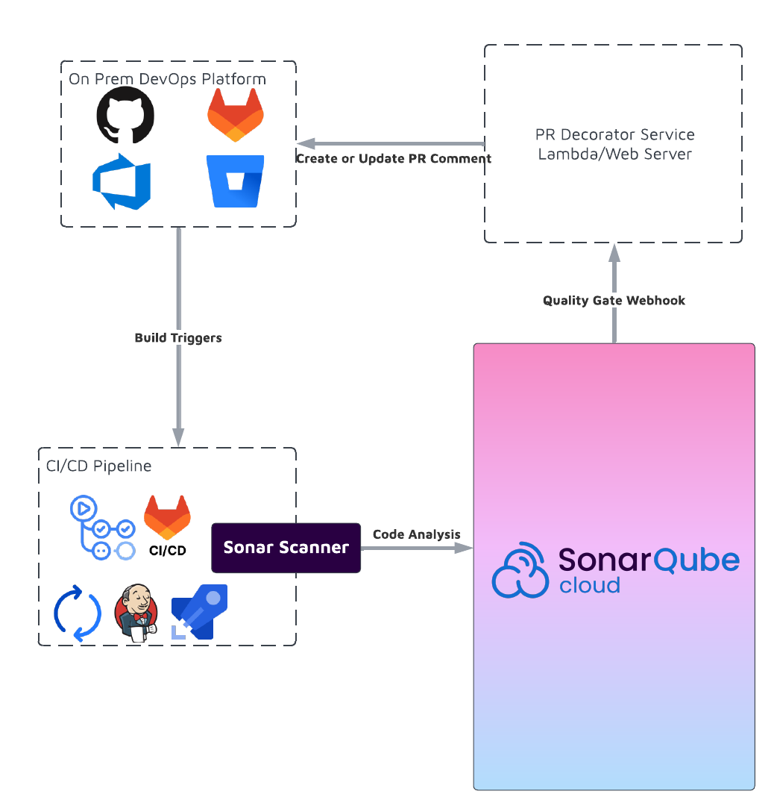

# Flask PR Service

This is a simple Flask app that listens for incoming webhooks from SonarCloud and posts a comment to a GitLab merge request with the SonarCloud analysis results. The app extracts relevant data from the webhook payload and generates a comment based on the analysis results. The comment includes the project name, branch name, quality gate status, and a list of metrics that failed the quality gate. The app extracts some custom set properties (GitLab project ID and merge request IID) from the webhook payload and uses them to post a comment to the corresponding merge request. It also checks if an existing comment with the specified identifier already exists and updates it if necessary.



## Prerequisites

- Docker

## Installation

1. Clone the repository:

    ```sh
    git clone <repository-url>
    cd <repository-directory>
    ```

2. Build the Docker image:

    ```sh
    docker build -t flask-pr-service .
    ```

## Usage

### Starting the Service

To start the service, run:

```sh
docker run -d -p 5000:5000 --name flask-pr-service \
  -e GITLAB_URL=http://gitlab:80/ \
  -e GITLAB_TOKEN=your_gitlab_token \
  flask-pr-service
```

This will start the Flask app and make it available on port 5000.

### Stopping the Service
To stop the service, run:
```
docker stop flask-pr-service
docker rm flask-pr-service
```

### Environment Variables
The following environment variables are used by the service:

`GITLAB_URL`: The URL of the GitLab instance.
`GITLAB_TOKEN`: The GitLab private token for authentication.

### Notice
This setup assumes the project is using the default "Sonar Way" quality gate and may require modifications to handle custom quality gates. If you have added additional conditions to your quality gate, you may need to modify the generate_comment function in pr-service.py to handle the custom conditions.
